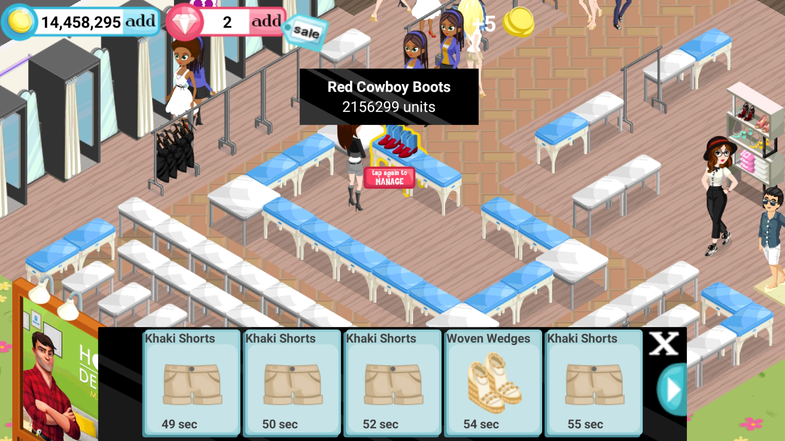

***

# Significant loss - November 12th 2020

During my November 12th 2020 Fashion Story session, I was moving items out of the way of shoppers. I moved all items, except for 1, then I made a critical mistake and put a table in storage that contained 2156299 units of Red Cowboy Boots, something that took me more than a year to get during sessions from 2016 to 2018.

At the time of this happening, I was extremely frustrated, and I quit the game early. It only took me 12 minutes to recover from it, as it was well documented, and wasn't that important, considering the game. Nevertheless, it was still a loss.

Here is the last picture of the item:

<!-- LinkV1 !-->
<!--!-->
<!-- LinkV2!-->

***
